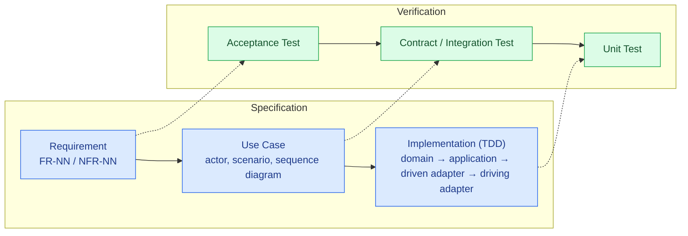
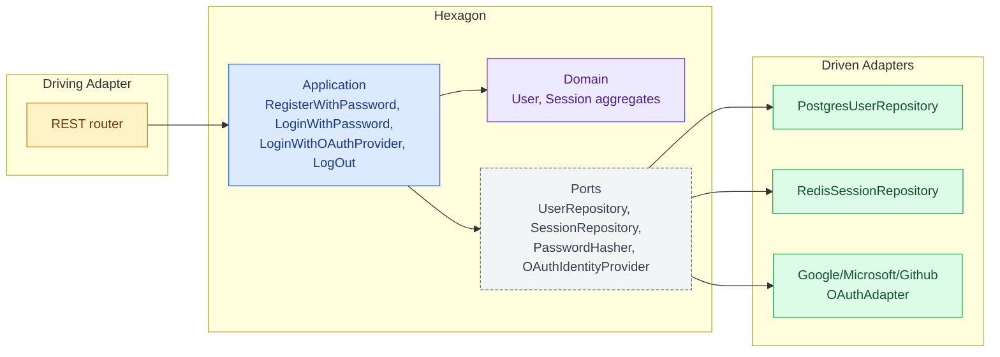
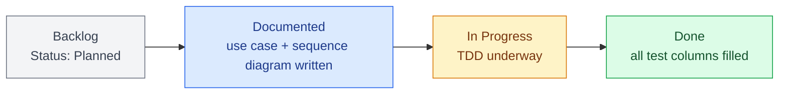
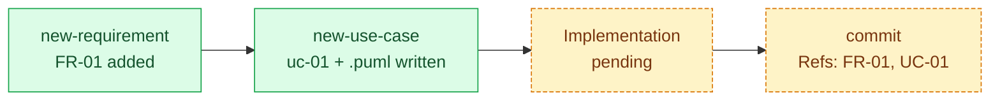

# Engineering Guide: The AI-Assisted V-Model Loop

This document ties together the four things this repo practices at once: the **V-Model**
(what order work happens in), **DDD + hexagonal architecture** (how the code is shaped),
a lightweight **Kanban flow** (how work-in-progress is tracked), and the **AI-assisted
loop** (how Claude Code's skills/agents/subagents/hooks carry out each step). It's a guide
for *using* the process this repo has already committed to in `CLAUDE.md`, not a
replacement for it — when in doubt, `CLAUDE.md` is the source of truth.

## 1. The V-Model, mapped to this repo

The V-Model pairs each left-side (specification) step with a right-side (verification)
step at the same level:



`docs/v-model/traceability.md` is the literal spine of this diagram: each row is one
requirement, and its three test columns (Acceptance / Contract-Integration / Unit) are the
right-hand side that must eventually stop reading `planned`.

This repo currently keeps the left side to two artifact types — **requirement** and **use
case** — rather than adding separate "system design" and "module design" documents.
Architecture is fixed doctrine (hexagonal, see §2) recorded once in `CLAUDE.md` plus
`docs/adr/` for exceptions, and a use case's sequence diagram is the module-level design
for anything simple enough not to need its own document. Add a dedicated design doc type
only when a specific aggregate's internal complexity (a state machine, multiple
invariants) actually outgrows what a sequence diagram shows — don't build that scaffolding
ahead of a concrete need.

**The cycle, step by step:**

1. **Requirement** — `new-requirement` skill appends an FR-NN/NFR-NN row and a `planned`
   traceability stub.
2. **Use case** — `new-use-case` skill scaffolds the `.md` (actor/trigger/scenario) and the
   `.puml` sequence diagram, with `[UC-NN.n]` tags on each diagram message so a step can be
   pointed at directly while troubleshooting (see `uc-01`..`uc-04` for the pattern).
3. **Implementation** — TDD, inside-out: domain → application → driven adapter → driving
   adapter, mirrored on the frontend once it has a `core/` layer. `tdd` skill drives this.
4. **Close the loop** — update `traceability.md` with the real test file paths, replacing
   `planned`. `commit` skill drafts the commit with the right `Refs:` line.

Cross-cutting decisions that don't belong to one use case (session storage strategy,
how OAuth providers are adapted) go through `new-adr` instead of steps 1–2 — see
ADR-0001 and ADR-0002 for the two already recorded this way.

## 2. DDD + Hexagonal Architecture

The hexagon is the enforced boundary in `CLAUDE.md`: `domain/` and `application/`
(backend) must never import a framework. Concretely:

- **Domain** — the `User` and `Session` aggregates, their value objects
  (`Email`, `PasswordCredential`, `OAuthProvider`, `SessionId`), and domain rules (account
  linking, password/email validation). Pure business rules, no I/O.
- **Application** — use cases (`RegisterWithPassword`, `LoginWithPassword`,
  `LoginWithOAuthProvider`, `LogOut`) that orchestrate the domain and call out through
  **ports** the domain/application layer owns: `UserRepository`, `SessionRepository`,
  `PasswordHasher`, `OAuthIdentityProvider`, `Clock`, `IdGenerator`.
- **Driving adapter** — the one thing that calls *into* the hexagon today: the REST
  router. There is no MCP or other driving adapter in this project (see `CLAUDE.md`).
- **Driven adapters** — things the hexagon calls *out* to: `PostgresUserRepository`
  (implements `UserRepository`), `RedisSessionRepository` (implements `SessionRepository`,
  per ADR-0001), and one adapter per provider — `GoogleOAuthAdapter`,
  `MicrosoftOAuthAdapter`, `GithubOAuthAdapter` — each implementing `OAuthIdentityProvider`
  (per ADR-0002).



Every use case's sequence diagram shows the REST entry point, one application call, then
one path down through domain → port → driven adapter (see `uc-01-register-with-password.puml`
for the simplest case, `uc-03-login-with-oauth-provider.puml` for the two-leg redirect
flow that also calls out to an external provider). NFR-01 is the automated-review check
for this boundary; `docs/adr/` is where a boundary-adjacent decision gets its reasoning
recorded once, instead of re-litigated per use case.

Branching (trunk-based, `feat/*` / `hotfix/*` / `experiment/*` off `main`) is covered in
[`branching-strategy.md`](branching-strategy.md).

## 3. Kanban: tracking work without a separate tool

Requirements already carry a `Status` field in `docs/requirements/functional.md` /
`non-functional.md`. Reading that field as Kanban columns needs no new tool:

| Column | Status value | Meaning |
|---|---|---|
| **Backlog** | `Planned` | Requirement exists, no use case yet. |
| **Documented** | `Documented — implementation pending` | Use case + sequence diagram written; `traceability.md` row stubbed. |
| **In Progress** | *(not yet a formal value — add one when needed)* | TDD implementation underway, inside-out. |
| **Done** | *(traceability row has real test paths, no `planned` left)* | All three test columns filled in; requirement fully verified. |



Pull one requirement across all four columns before starting the next — this is the same
discipline `CLAUDE.md` states as "small, traceable, test-first increments over building
ahead of documented requirements." Right now FR-01 through FR-04, FR-07, and FR-08 sit in
**Documented** (use cases UC-01..UC-04 written); FR-05, FR-06, FR-09, FR-10 sit in
**Backlog**. That's a signal to finish UC-01..UC-04's implementation before writing a
fifth use case.

To see the board today: `grep -n '|' docs/requirements/*.md` for columns 1–3, and
`docs/v-model/traceability.md` for which rows still say `planned`. If this ever needs a
real board (GitHub Projects, etc.), wire it to these same states rather than inventing a
parallel status field.

## 4. The skill catalog

All skills live in `.claude/skills/`. Each is invoked either by name (`/skill-name`) or
automatically, when its frontmatter `description` matches the task at hand. `commit` is
the one exception in practice: nothing in its frontmatter blocks auto-invocation, but its
own instructions ("Only commit when the user has actually asked for it in this turn —
never commit proactively") are the enforcement — read them as a hard constraint, not
optional guidance, if this skill is ever loaded outside a direct user request.

| Skill | Invoke when | Touches | Deliberately does *not* |
|---|---|---|---|
| `new-requirement` | Starting a new capability or constraint (V-Model step 1) | `docs/requirements/*.md`, stubs a `traceability.md` row | Write a use case or any code |
| `new-use-case` | A requirement needs its use case (V-Model step 2) | `docs/usecases/uc-NN-*.{md,puml}`, `traceability.md` | Write implementation code |
| `grill-me` | Before TDD on a use case's first slice, or any decision worth pressure-testing | Nothing (conversation only, until it hands off) | Write code or docs itself |
| `new-adr` | A cross-cutting decision doesn't fit one use case | `docs/adr/NNNN-*.md` | Auto-decide `Status`; that's a human call |
| `new-branch` | Starting work on a use case, ADR, fix, or spike | Creates and checks out a git branch | Create the PR, commit anything |
| `tdd` | Implementing a use case via red-green-refactor | `backend/` or `frontend/` source + test files, one commit per increment | Commit without showing the test/implementation and getting approval first |
| `verify` | Confirming runtime behavior of a change | Nothing (drives the app through `TestClient`/`npm run dev`) | Replace `tdd`'s own test suite |
| `commit` | User explicitly asks to commit | Stages named files, creates the commit | Commit proactively, use `git add -A`, or `--no-verify`/`--amend` without being asked |
| `token-efficiency` | Long session, before a big read/search, before spawning a subagent | Nothing (advisory only) | Rewrite language for brevity — it targets tool-use patterns, not prose |
| `conformance-check` | Checking a requirement/use case/ADR/code against the *industry* practice it claims to follow | Nothing (report only) | Check this repo's own rules (that's `code-review`/manual review), or edit files to fix what it finds |

Running one is either typing `/skill-name` or just describing the task — e.g. "add a
requirement for session timeout" is enough for `new-requirement` to trigger without the
slash form, since it isn't set to manual-only.

## 5. The AI-assisted loop: skills, agents, subagents, hooks

Four different mechanisms, each suited to a different kind of repeatability:

- **Skills** are *instructions*: markdown loaded into context, followed with judgment. Use
  them for anything that needs drafting, reasoning, or a template applied to varying input
  — which is why requirement/use-case/ADR scaffolding and commit drafting are skills, not
  hooks.
- **Agents/subagents** are for *delegated work that shouldn't clutter the main
  conversation* — a fork when the work needs this session's context (e.g. investigating a
  question raised mid-task), a fresh agent (like `Explore`) when it's a self-contained
  search or lookup. The tradeoff is cost: a fresh agent re-derives context from zero, so
  it's only worth it for work that's genuinely separable.
- **Hooks** are *deterministic, harness-enforced* — they run whether or not a skill's
  instructions were followed. **This repo has none configured yet** (no
  `.claude/settings.json`). The natural first candidates, drawn from this repo's own rules:
  a `PreToolUse` hook on `git commit` rejecting `--no-verify`/`--amend` or `git add -A`,
  and one checking the message matches `<type>(<scope>): summary` before it's allowed
  through — enforcing what the `commit` skill already asks for, but without depending on
  the model remembering to ask.

The rule of thumb: if it's mechanical and must never be skipped, it belongs in a hook. If
it needs to draft content or make a judgment call, it belongs in a skill. If it's research
or a side-question that would otherwise fill up context with output you won't reuse,
delegate it to a fork or agent instead of doing it inline.

## 6. Verifying against industry practice, and the Exception convention

Following this repo's own rules (`CLAUDE.md`, `CONTRIBUTING.md`) isn't the same as
following the industry practice those rules are *based on* — Cockburn's use-case writing,
Evans/Vernon's DDD tactical patterns, Nygard's ADR format, Beck's TDD, hexagonal
architecture's port/adapter discipline. The `conformance-check` skill checks an artifact
against the named source for its type, not just this repo's paraphrase of it. It
complements, not replaces, `code-review`/`security-review` for bugs/vulnerabilities —
which matter more than usual here, since this is an authentication system.

Where a deviation from standard practice is deliberate (not an oversight), mark it inline
instead of leaving it silent:

```markdown
> **Exception:** <what's being skipped or done differently, and why>
```

`conformance-check` treats a point covered by one of these as *acknowledged*, not a defect — the
convention exists so a documented tradeoff and an unnoticed gap don't look the same. This
is the same `>` device already used for the feature-intent blurbs in
`docs/requirements/functional.md`; the bold `**Exception:**` lead-in is what distinguishes
"why this feature exists" from "why we're deviating from the norm here."

## 7. Worked example

FR-01/UC-01 (Register with Password) end to end, as already recorded in this repo:

1. `new-requirement` — FR-01 added to `functional.md`, stub row added to
   `traceability.md`.
2. `new-use-case` — `uc-01-register-with-password.md` + `.puml` written, `[UC-01.n]` tags
   added to the diagram, `traceability.md` row updated to `UC-01 Register with Password`.
3. *(pending)* — implementation not yet started; the backend is a clean slate (just the
   composition root and the generic `IdGenerator` port, see `CLAUDE.md`) ready for UC-01's
   first TDD increment.
4. Once implemented: `traceability.md`'s FR-01 row test columns get real paths, and
   `commit` drafts `feat(domain): ...` / `test(domain): ...` commits with `Refs: FR-01,
   UC-01`.



ADR-0001 and ADR-0002 sit beside this flow, not inside it: each recorded one cross-cutting
decision (session storage, OAuth adapter shape) once, so every future use case's diagram
can assume them rather than re-argue them.
