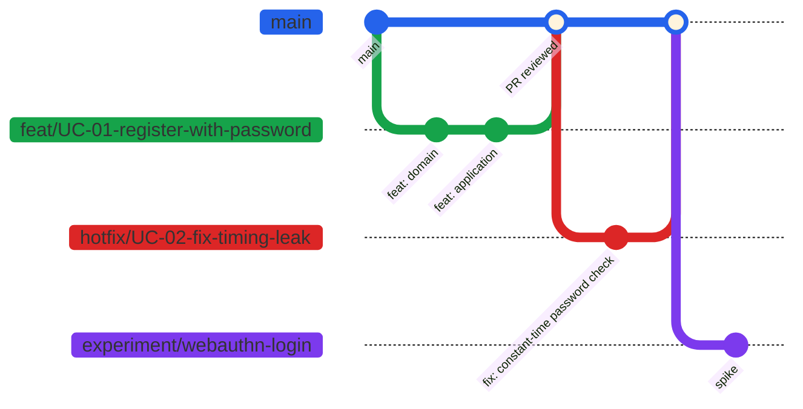
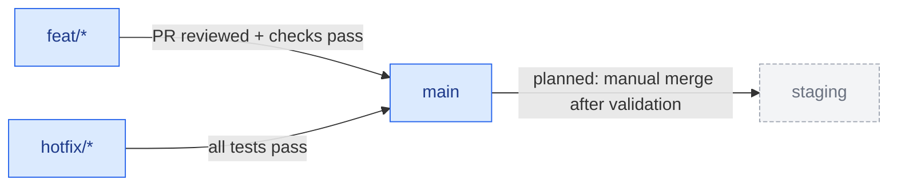

# GitHub Branching Strategy

This repository follows **Trunk Based Development (TBD)**: short-lived branches, small
increments, and `main` always in a releasable state. It fits this repo's practice goal of
small, traceable, test-first increments (see `CLAUDE.md`) and is meant to support CI/CD
for the backend and frontend once they exist.

> **Status:** `main`, `feat/*`, `hotfix/*` and `experiment/*` apply today. `staging`,
> sprint release tags and the CI pipeline are **planned** — there is no application code,
> CI, or deployment yet.



## Branch Types

| Branch         | Description                                                                              |
| -------------- | ---------------------------------------------------------------------------------------- |
| `main`         | The trunk. Holds stable deployable code. Protected. All other branches branch from here. |
| `staging`      | *(Planned)* Pre-production code for testing before release.                              |
| `hotfix/*`     | Short-lived branches from `main` for production-critical fixes.                          |
| `feat/*`       | Feature branches. Merged into `main` after testing and code review.                      |
| `experiment/*` | Used for PoCs or spikes. Not guaranteed to be merged.                                    |

## Branch Naming Conventions

This repo has no Jira, so branches are named after the unit of work they implement — and
that unit is the **use case**, not the requirement: a UC is the vertical slice (domain →
application → driven adapter → driving adapters) that actually lands in one branch, while
an FR/NFR is just the requirement row(s) it satisfies and stays in the commit `Refs:` line
instead (see `CONTRIBUTING.md`). Branches for architecture-only work with no use case
(e.g. a cross-cutting structural change) are named after the ADR instead.

| Branch Type  | Naming Convention      | Example                          |
| ------------ | ----------------------- | --------------------------------- |
| `feat`       | `feat/<UC/ADR id>-<desc>` | `feat/UC-01-register-with-password` |
| `hotfix`     | `hotfix/<UC/ADR id>-<desc>` | `hotfix/UC-02-fix-timing-leak`    |
| `experiment` | `experiment/<desc>`     | `experiment/webauthn-login`           |

Scaffolding/tooling branches with no use case (e.g. skills, docs setup) use `feat/<desc>`
without an id.

## Merge Rules

| Source     | Target    | Rule                                                 |
| ---------- | --------- | ---------------------------------------------------- |
| `hotfix/*` | `main`    | Must pass all tests                                  |
| `feat/*`   | `main`    | PR must be reviewed and pass all checks              |
| `main`     | `staging` | *(Planned)* Manual merge after validation            |



<!-- TODO: add ./img/image-2-ci.png (CI pipeline diagram) -->

## Release Strategy *(planned)*

- Sprint releases are tagged from `main` at the end of each sprint.
- Use **semantic versioning** for release tags (e.g., `v1.0.0`, `v1.1.0`).

```bash
# Tag and push a release
git tag -a v1.0.0 -m "Sprint 1 release"
git push origin v1.0.0
```
